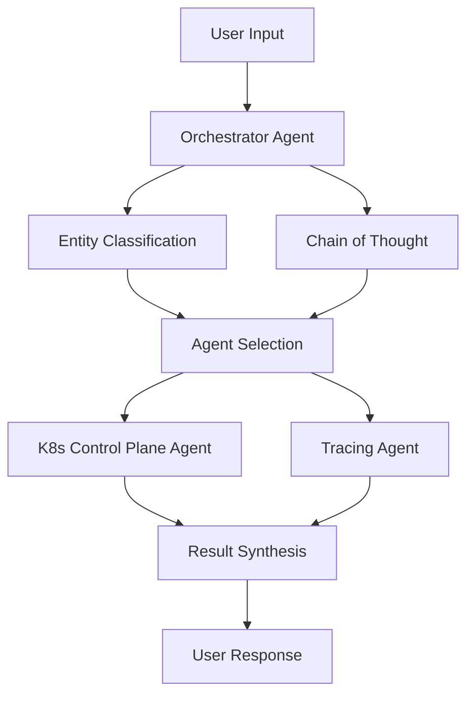

# Multi-Agent Kubernetes Management System Architecture

## Overview
This system implements a hierarchical multi-agent architecture for managing and observing Kubernetes clusters. The architecture consists of specialized agents coordinated by an orchestrator that uses entity classification, chain-of-thought reasoning, and contextual routing.

## Core Components

### 1. Orchestrator Agent
- **Purpose**: High-level coordination and reasoning
- **Key Responsibilities**:
  - Entity Classification: Analyzes user input to identify entities (services, pods, traces, etc.)
  - Chain of Thought (CoT) Reasoning: Breaks down complex queries into sub-tasks
  - Agent Selection: Routes tasks to appropriate specialized agents
  - Context Management: Maintains conversation and execution context
  - Result Synthesis: Combines outputs from multiple agents into coherent responses

### 2. Kubernetes Control Plane Agent
- **Purpose**: Direct interaction with Kubernetes control plane components
- **Key Responsibilities**:
  - Pod Management: Status, logs, and operations
  - Service Management: Endpoints, configurations
  - Deployment Management: Status, scaling, updates
  - Resource Monitoring: CPU, memory, storage
  - Configuration Management: ConfigMaps, Secrets
  - RBAC Operations: Roles, bindings, permissions

### 3. Tracing Agent
- **Purpose**: Application-level tracing and debugging through Jaeger
- **Key Responsibilities**:
  - Trace Collection: Gather distributed traces
  - Service Dependency Analysis: Map service interactions
  - Performance Analysis: Latency and bottleneck identification
  - Error Tracking: Trace-based error detection
  - Root Cause Analysis: Trace correlation with issues

## Information Flow



## Agent Communication Protocol

1. **Input Processing**:
   ```json
   {
     "query": "user input string",
     "entities": ["identified", "entities"],
     "context": {
       "conversation_id": "uuid",
       "previous_actions": []
     }
   }
   ```

2. **Inter-Agent Messages**:
   ```json
   {
     "from_agent": "orchestrator",
     "to_agent": "k8s",
     "action": "get_pod_status",
     "parameters": {
       "namespace": "default",
       "pod_name": "example"
     },
     "context": {
       "task_id": "uuid",
       "priority": "high"
     }
   }
   ```

3. **Agent Responses**:
   ```json
   {
     "status": "success",
     "data": {},
     "metadata": {
       "latency": "100ms",
       "source": "k8s-api"
     }
   }
   ```

## Chain of Thought Example

1. User Query: "Why is my payment service having high latency?"
2. Orchestrator CoT:
   - Identify service: payment-service
   - Check pod status for immediate issues
   - Analyze recent traces for latency patterns
   - Correlate with dependent services
   - Examine resource utilization

## Implementation Details

### Entity Classification
- Uses LLM-based classification
- Entity types: Service, Pod, Trace, Metric, Error
- Confidence scoring for routing decisions

### Context Management
- Maintains conversation history
- Tracks agent actions and results
- Manages timeouts and retries
- Handles error propagation

### Result Synthesis
- Combines technical data with natural language
- Prioritizes critical information
- Provides actionable insights
- Maintains conversation coherence

## Security Considerations

1. **Access Control**:
   - Agent-specific RBAC profiles
   - Audit logging of agent actions
   - Least privilege principle

2. **Data Handling**:
   - Sensitive data masking
   - Secure inter-agent communication
   - Credential management

## Extension Points

1. **New Agents**:
   - Security Agent for policy enforcement
   - Cost Management Agent
   - Capacity Planning Agent

2. **Enhanced Capabilities**:
   - Predictive Analytics
   - Automated Remediation
   - Custom Metric Analysis 