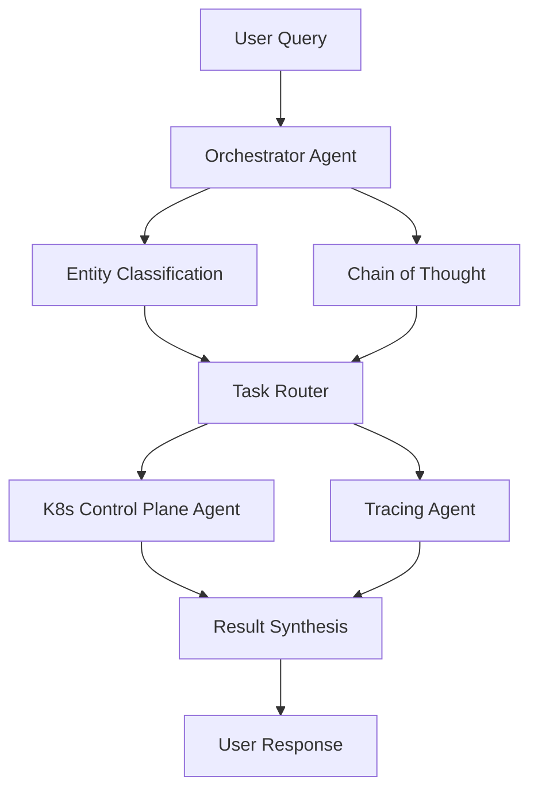

# Kubernetes Multi-Agent System

A sophisticated multi-agent system for monitoring, analyzing, and troubleshooting Kubernetes clusters. The system combines control plane monitoring with application-level tracing through Jaeger to provide comprehensive insights into cluster and application health.

## Agent Architecture

### 1. Orchestrator Agent (`orchestrator/agent.py`)
The central coordinator that manages communication and task delegation between specialized agents.

**Key Features:**
- Entity Classification: Identifies and classifies entities in user queries
- Chain of Thought Reasoning: Breaks down complex queries into actionable steps
- Result Synthesis: Combines outputs from multiple agents into coherent responses
- System Health Analysis: Coordinates comprehensive health checks across the system

**Core Methods:**
```python
async def process_query(query: str, conversation_id: Optional[str] = None) -> Dict
async def analyze_system_health(request: AnalysisRequest) -> Dict[str, Any]
async def classify_entities(query: str) -> List[Entity]
async def generate_reasoning_steps(query: str, entities: List[Entity]) -> List[Dict]
```

### 2. Kubernetes Control Plane Agent (`k8s/agent.py`)
Specializes in monitoring and analyzing Kubernetes control plane components.

**Key Features:**
- Control Plane Status Monitoring
- etcd Health Analysis
- API Server Metrics Analysis
- Scheduler Decision Analysis

**Core Tools:**
```python
@tool("get_control_plane_status")
@tool("analyze_etcd_health")
@tool("check_api_server_metrics")
@tool("analyze_scheduler_decisions")
```

### 3. Tracing Agent (`tracing/agent.py`)
Handles application-level tracing through Jaeger integration.

**Key Features:**
- Service Discovery
- Trace Analysis
- Dependency Mapping
- Performance Analysis
- Error Detection

**Core Tools:**
```python
@tool("list_traced_services")
@tool("get_service_operations")
@tool("analyze_service_traces")
@tool("get_service_dependencies")
```

## Information Flow



## Usage Examples

### 1. System Health Analysis
```python
from agents.orchestrator.agent import OrchestratorAgent, AnalysisRequest

orchestrator = OrchestratorAgent()
analysis = orchestrator.analyze_system_health(
    AnalysisRequest(
        service_name="my-service",
        time_window=30,
        include_control_plane=True,
        include_tracing=True
    )
)
```

### 2. Service Dependency Analysis
```python
from agents.tracing.agent import TracingAgent

tracing = TracingAgent()
dependencies = tracing.get_service_dependencies("my-service")
```

### 3. Control Plane Health Check
```python
from agents.k8s.agent import K8sControlPlaneAgent

k8s = K8sControlPlaneAgent()
status = k8s.get_control_plane_status()
```

## Configuration

### Environment Variables
```bash
# Required
ANTHROPIC_API_KEY=your_api_key_here

# Optional (defaults shown)
K8S_API_URL=http://localhost:8000
JAEGER_QUERY_URL=http://localhost:30686
```

### Kubernetes Requirements
- Access to control plane components
- Permission to execute kubectl commands
- Access to metrics endpoints
- Permission to read pod logs

### Jaeger Requirements
- Accessible query endpoint
- Proper sampling configuration
- Adequate retention period

## Development

### Project Structure
```
agents/
├── __init__.py
├── orchestrator/
│   └── agent.py
├── k8s/
│   └── agent.py
├── tracing/
│   └── agent.py
└── README.md
```

### Adding New Capabilities

1. **New Agent Methods**
```python
@tool("new_tool_name")
def new_tool(self, parameters) -> Dict[str, Any]:
    """Tool description."""
    # Implementation
```

2. **Extending Orchestrator**
```python
async def new_orchestrator_method(self, parameters) -> Dict[str, Any]:
    """Method description."""
    # Implementation
```

### Testing

Run tests with:
```bash
python -m pytest tests/
```

## Integration with Development Environment

The multi-agent system is designed to work with the development cluster setup, which includes:

- OpenTelemetry Demo application
- Online Boutique (Microservices Demo)
- Sock Shop
- Bank of Anthos
- Observability stack (Prometheus, Grafana, Jaeger)

For development cluster setup details, see [DEVCLUSTERCLIST.md](../docs/DEVCLUSTERCLIST.md).

## Contributing

1. Fork the repository
2. Create a feature branch
3. Add tests for new functionality
4. Submit a pull request

## License

This project is licensed under the MIT License - see the LICENSE file for details. 